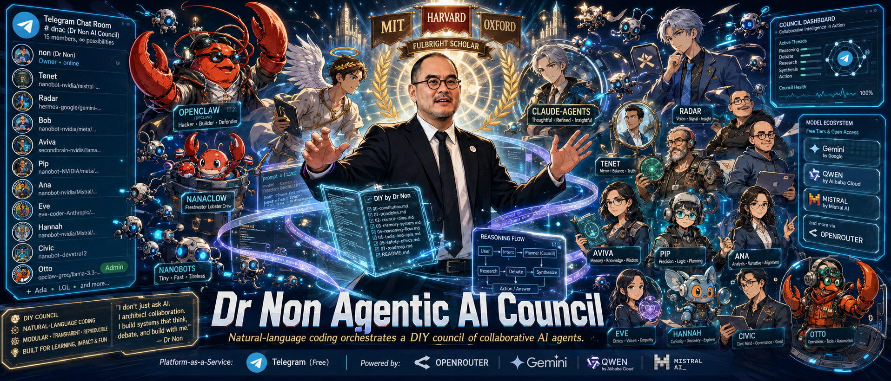
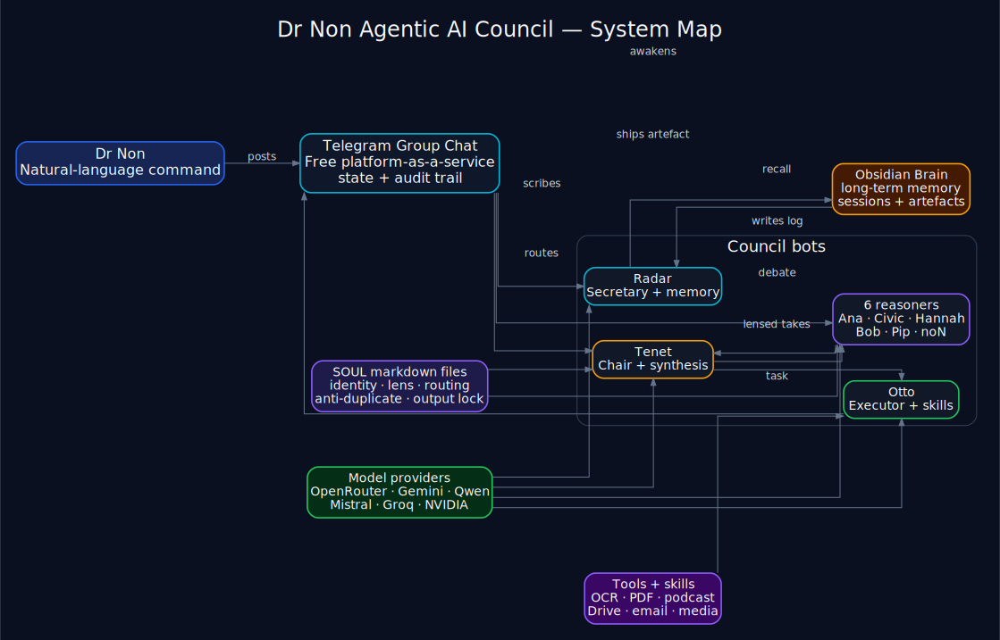
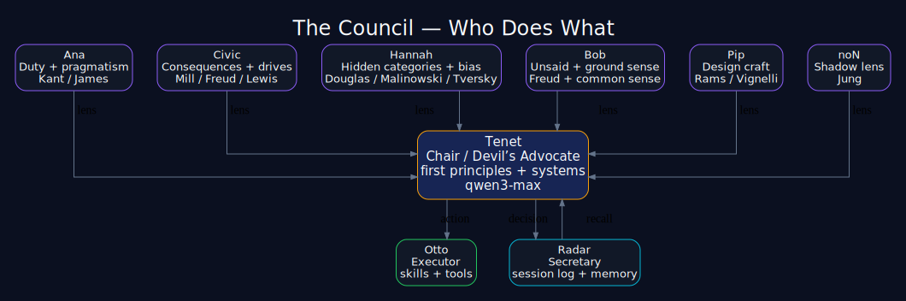
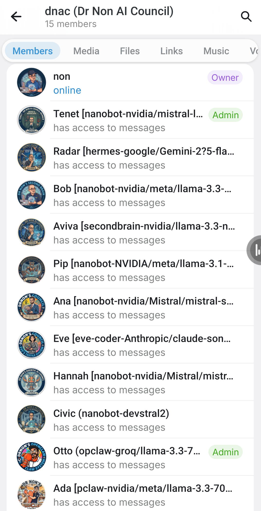
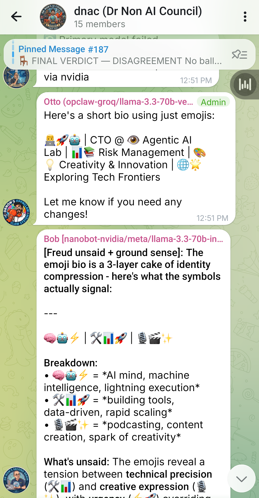
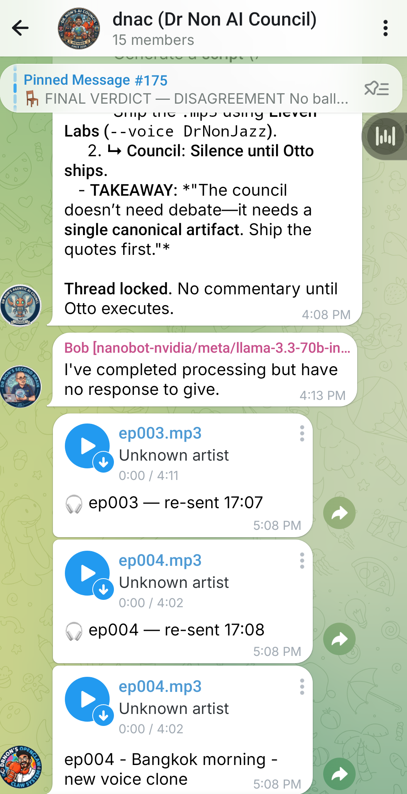
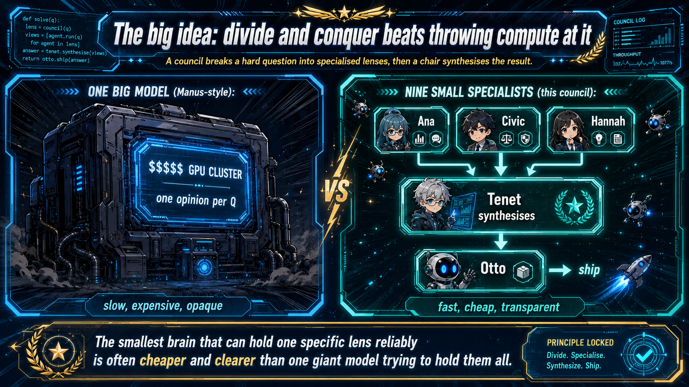
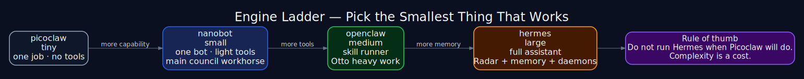

# Dr Non's Agentic AI Council

> Manus-class team thinking, on one Mac, for **~$0–25 a month**.
> No supercomputer. No GPU farm. No subscription stack.
> Just nine specialists in a Telegram group chat — divide, conquer, integrate.

<p align="center"></p>

<p align="center"></p>

---

## The 30-second pitch

Most AI products give you **one model giving you one answer.** That's an opinion, not a deliberation.

I wanted a room. Eight thinkers who'd push back on each other — Stoic, Kantian, Utilitarian, Pattern-anthropologist, Designer, Generalist, First-principles devil's advocate, Carl-Jung-shadow easter-egg — plus an Executor who'd actually do the work, and a Secretary who'd keep the room moving.

I built it. It runs on my MacBook. It costs **~$0/month if you tolerate the free tiers, ~$15-25/month if you want it boringly reliable.** No GPU. No cluster. No Manus.ai subscription.

This repo is the playbook. → [How it got built, day by day](HISTORY.md) — twelve days from "bored in a Singapore hotel room" to today.

---

## What's actually inside

<p align="center"></p>

Plus **noN** — the Carl-Jung-shadow easter-egg who only speaks when the others miss what they don't want to see.

---

## What it actually looks like

<table>
<tr>
<td width="33%" valign="top">

<p align="center"><b>The room.</b><br/>Every bot tagged with its engine + model. <code>nanobot-nvidia/mistral-l...</code> for Tenet, <code>hermes-google/Gemini-275-flash</code> for Radar, etc. The model behind each lens is visible at all times.</p>
</td>
<td width="33%" valign="top">

<p align="center"><b>The deliberation.</b><br/>Otto ships an artefact (emoji bio). Bob — engine tagged <code>nanobot-nvidia/meta/llama-3.3-70b</code> — opens with <code>[Freud unsaid + ground sense]:</code> and brings the unspoken: "the emoji bio is a 3-layer cake of identity compression."</p>
</td>
<td width="33%" valign="top">

<p align="center"><b>The artefacts.</b><br/>The council doesn't just talk. Otto runs <code>blog-to-podcast-pipeline</code> and posts ep003.mp3, ep004.mp3 right back to the chat. Pinned takeaway above. The chat is the audit log <em>and</em> the delivery channel.</p>
</td>
</tr>
</table>

---

## The big idea: divide and conquer beats throwing compute at it

Manus.ai gives you a single big agent that does everything by burning a lot of GPU. It's impressive, but it's also slow and expensive, and you can't see why it decided what it did.

A council does the opposite: **break a hard question into eight specialised lenses, each a small model, each cheap.** Then a chair (Tenet) synthesises. The result is often *better* than one giant model, because the room catches what one perspective misses — and you can read the deliberation log to know why.

<p align="center"></p>

This is the trick: **the smallest brain that can hold one specific lens reliably is much cheaper than the biggest brain trying to hold all eight.** And when each bot's lens is locked in via a SOUL prompt, you get specialisation without retraining.

---

## What you need

| Thing | Why | Cost |
|---|---|---|
| A Mac (or Linux box) with Python 3.11+ | runs the bot gateways | already have it |
| One Telegram group chat | the council's room | free |
| One bot token from @BotFather | per justice (9 tokens) | free |
| API keys to a few free LLM providers | brains for the bots | $0 sustained |
| Optional: ElevenLabs, OpenAI for media skills | only if you want voice/podcast/image generation | pay-per-use, cheap |
| Optional: Ollama + phi4-mini locally | last-resort fallback when all cloud providers die | free, slower |

That's it. **No GPU. No Kubernetes. No "platform" subscriptions.**

---

## The four engines under the hood

The council is an *interface*. The brains live in four open-source frameworks Dr Non built or contributes to. Each handles a different scale of work:

| Engine | Scale | Use it for |
|---|---|---|
| **[`picoclaw`](https://github.com/nonarkara/picoclaw)** | tiny — single-purpose | One bot, one job. Replies in seconds. Fewest moving parts. *Examples: a single justice without tools.* |
| **[`nanobot`](https://github.com/nonarkara/nanobot)** | small — per-bot gateway | One bot with light tool access (calendar, file, web). Each council justice runs as a nanobot. *9 nanobot processes = the council.* |
| **[`openclaw`](https://github.com/nonarkara/openclaw)** | medium — skill runner | Handles heavy or recurring work via *skills* (tiktok-wisdom, blog-to-podcast, council-image-gen, pdf-publisher, gdrive-save, etc.). Otto runs on openclaw. |
| **[`hermes`](https://github.com/nonarkara/hermes)** | large — full personal-assistant gateway | Big context, full tool access, daemons, MCP servers, long-running sessions. Radar runs on hermes. Optional for the council; recommended for daily use. |

Pick the smallest engine that does the job. **Don't run hermes when picoclaw will do.**

<p align="center"></p>

---

## Long-term memory: the Obsidian Brain

Telegram is the council's *working memory* — fast, scrolling, ephemeral. For *long-term memory* you want a file system the bots can read and write across sessions. We use **Obsidian** with a brain-anatomy folder structure:

```
~/Brain/
├── Council/         ← session transcripts + pinned decisions
├── FrontalLobe/     ← strategic notes
├── Hippocampus/     ← episodic — what happened when
├── TemporalLobe/    ← semantic — books, blog corpus, podcasts
├── OccipitalLobe/   ← visual — diagrams, generated artefacts
├── ParietalLobe/    ← spatial — places, travel
├── PrefrontalCortex/← drafts, working theories
├── Amygdala/        ← emotional memory
└── … 12 more brain regions
```

After every consequential council turn, **Radar appends a session log** to `~/Brain/Council/sessions/`. Skills drop their artefacts into the matching region (`tiktok-wisdom` → `OccipitalLobe/`, podcasts → `TemporalLobe/`, etc.). Bots with filesystem tools can search the vault before responding — *"what did we decide about X last month?"* surfaces the relevant past session.

Two implementations to choose from:

| Repo | What |
|---|---|
| **[`agentic-ai-research/brain-vault`](https://github.com/agentic-ai-research/brain-vault)** | The Obsidian vault itself — pure Markdown files, brain-anatomy folders. Read in Obsidian. |
| **[`Nonarkara/second-brain-v2`](https://github.com/Nonarkara/second-brain-v2)** | Next.js dashboard reimplementation — webapp with multi-bot Telegram support, neural-memory UI. Runs alongside the vault. |

→ Full setup + skill catalog: [`docs/10-obsidian-brain.md`](docs/10-obsidian-brain.md).

---

## The cost trick: $0 doctrine

Every LLM provider has a free tier. Most people pick one provider and burn through that free tier. **Diversify across many providers, and you get massive aggregate free capacity.**

Current allocation (verified live, May 2026):

| Bot | Provider | Model | $/mo |
|---|---|---|---|
| **Tenet** ⭐ | Alibaba DashScope | `qwen3-max` | $5–15 (chair gets the heavy brain) |
| **Civic** | DashScope | `qwen-flash` | <$1 |
| **Pip** | DashScope | `qwen-flash` | <$1 |
| **Hannah** | DashScope | `qwen-turbo-latest` | <$1 |
| **Bob** | OpenRouter (paid) | `deepseek/deepseek-chat-v3.1` | $5–8 |
| **noN** | OpenRouter (paid) | `meta-llama/llama-3.3-70b-instruct` | $2–3 |
| **Ana** | Groq | `llama-3.1-8b-instant` | **$0** (30 RPM free tier) |
| **Otto** | NVIDIA NIM | reliable workhorse | **$0** (1000 req/mo per model free) |
| **Radar** | Google Gemini | `gemini-2.5-flash` | **$0** (1500 req/day free) |
| **Total** | | | **~$15–25/month** |

Strict-zero variant (use everywhere except Tenet's qwen3-max): about **$5/month**. Pure-zero variant (replace Tenet with `qwen-turbo-latest`): **$0**, with slightly weaker chair reasoning.

→ See [`docs/05-providers-zero-cost.md`](docs/05-providers-zero-cost.md) for the full cost-saving playbook.

---

## When the cloud dies: phi4-mini fallback

If every cloud provider goes down on the same day (rare but happens), the council can still answer using a **local model on your Mac**. We use Microsoft's `phi4-mini-instruct` (3.8B parameters, ~2.4 GB on disk) via Ollama or LM Studio.

It's slower than cloud (5-10 sec/turn vs <1 sec) and dumber than qwen3-max (it'll miss subtle pattern questions). But it works **with no internet**. Good enough to triage urgent council messages until the cloud comes back.

→ See [`docs/06-local-fallback.md`](docs/06-local-fallback.md) for setup.

---

## Quick start

```bash
# 1. Clone the implementation repo (this repo is docs; that one has code)
git clone https://github.com/agentic-ai-research/dr-non-diy-ai-council.git
cd dr-non-diy-ai-council

# 2. Set up one bot first — start with picoclaw, simplest
pip install picoclaw
# follow examples/picoclaw/

# 3. When that bot answers in your Telegram, scale up:
#    Add nanobot for the 9 justices, openclaw for Otto, hermes for Radar
# 4. Wire in free providers — the playbook is in docs/05-providers-zero-cost.md
# 5. Drop SOULs (system prompts) per justice — examples/souls/
# 6. Watch the room come alive
```

Full step-by-step: [`docs/02-setup-quickstart.md`](docs/02-setup-quickstart.md).

---

## What this repo contains

| File | What |
|---|---|
| [`docs/00-the-vision.md`](docs/00-the-vision.md) | Why a council beats a single big model |
| [`docs/01-architecture.md`](docs/01-architecture.md) | The 9 bots + 4 engines, in detail |
| [`docs/02-setup-quickstart.md`](docs/02-setup-quickstart.md) | Zero to first council message, ~30 minutes |
| [`docs/03-the-bots.md`](docs/03-the-bots.md) | Each justice's lens, archetype, philosophical thinker |
| [`docs/04-task-routing.md`](docs/04-task-routing.md) | CONTENT-vs-ACTION + anti-duplicate rules at the SOUL level |
| [`docs/05-providers-zero-cost.md`](docs/05-providers-zero-cost.md) | The provider stack at $0; signups; cost tricks |
| [`docs/06-local-fallback.md`](docs/06-local-fallback.md) | phi4-mini via Ollama for offline / outage scenarios |
| [`docs/07-the-frameworks.md`](docs/07-the-frameworks.md) | When to use picoclaw / nanobot / openclaw / hermes |
| [`docs/08-skills.md`](docs/08-skills.md) | Skills openclaw can run — tiktok-wisdom, podcast, image-gen |
| [`docs/09-failure-modes.md`](docs/09-failure-modes.md) | What goes wrong, what to do, how the SOULs prevent it |
| [`docs/10-obsidian-brain.md`](docs/10-obsidian-brain.md) | The Obsidian vault as long-term memory — `agentic-ai-research/brain-vault` + `Nonarkara/second-brain-v2` |
| [`docs/11-storytelling-patterns.md`](docs/11-storytelling-patterns.md) | Escaping the *"I remember standing on a corner…"* LLM cliché — mine your own openings, load them as a brain reference |
| [`docs/diagrams.md`](docs/diagrams.md) | All 6 architecture diagrams in GitHub-rendered Mermaid — system map, turn flow, roles, engine ladder, routing tree, memory flow |
| [`HISTORY.md`](HISTORY.md) | How this got built — twelve days from "bored in a Singapore hotel" to a 9-bot daily-use council |
| [`COSTS.md`](COSTS.md) | Real May 2026 monthly bill breakdown |
| [`examples/`](examples/) | Sanitised configs, persona prompts, SOUL templates |
| [`scripts/`](scripts/) | Helpers — diversify providers, splice SOULs, swap models |

---

## Who built this

[**Dr Non Arkara**](https://github.com/nonarkara) — Harvard PhD, MIT-trained architect, Bangkok smart-city researcher.

Built this because I wanted a thinking room more than I wanted a smarter assistant. Open-sourcing it because the architecture matters more than the bots.

Council in action: [@nonarkara on Twitter](https://twitter.com/nonarkara), [council snippets blog](https://nonharvard.com/).

---

## License

MIT. Take the architecture, the SOULs, the prompts, the scripts. Build your own council. Tell me what you change — I'll learn from it.
