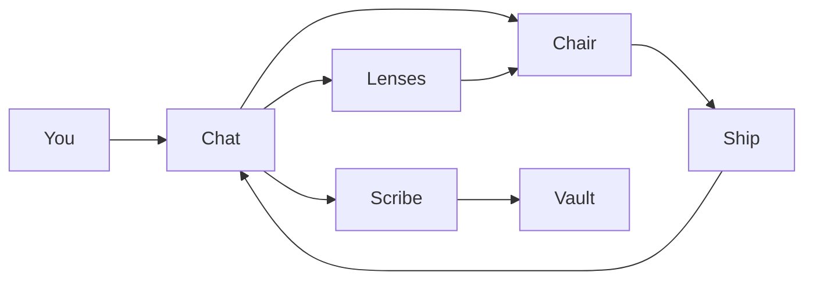
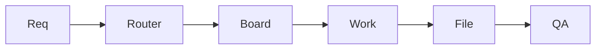

A council around one laptop, a city outside the window. The banner is illustration only — no live UI, no HUD, no title overlay.

# Dr Non's Agentic AI Council

**A nine-lens council pattern that runs on one Mac — divide, deliberate, then ship.**

[](LICENSE)

**Author.** [Non Arkaraprasertkul](https://github.com/Nonarkara) (Nonarkara) — architect, urban anthropologist, civic-studio practice at **Axiom X Co., Ltd.**, Bangkok.

Independent. Written for a **Thai–English** audience. Not an official depa, ASEAN, or municipal product.

เก้าเลนส์ในห้องแชทเดียวกัน รันบนแมคเครื่องเดียว — วิธีคิดแบบสภา ไม่ใช่กล่องดำ

---

## What this is

A **playbook** for a room of specialised AI bots that argue before they act.

Most AI products give you one model and one answer. That is an opinion, not a deliberation. This repo writes down a different shape: nine justices in one Telegram group, each locked to a lens, a chair who synthesises, an executor who ships artefacts, and a scribe who keeps a file. The room is the audit log.

This tree is documentation, sanitised templates, and a small factory scaffold. It is **not** a hosted product and **not** a running council. The bots, tokens, and personal vault stay on the operator's machine.

**What is actually here**

| Path | In this tree |
|---|---|
| [`docs/`](docs/) | 14 numbered field notes (vision through operating it) plus [`docs/diagrams.md`](docs/diagrams.md) |
| [`examples/souls/`](examples/souls/) | Three sample SOUL files — Tenet, Bob, Otto. Not a full nine-file dump |
| [`examples/configs/`](examples/configs/) | One placeholder nanobot template. No live tokens |
| [`examples/factory/`](examples/factory/) | A small Python factory-floor scaffold (router, blackboard, two workers) |
| [`scripts/`](scripts/) | `splice-task-routing.py` — splice routing addenda into a SOUL |
| [`diagrams/`](diagrams/) | Architecture SVGs, factory SVGs, and older screenshots |
| [`HISTORY.md`](HISTORY.md) | How the first council was stood up, day by day |
| [`COSTS.md`](COSTS.md) | Operator notes from May 2026 — not a live bill |

The nine justices named in [`docs/01-architecture.md`](docs/01-architecture.md) and [`docs/03-the-bots.md`](docs/03-the-bots.md):

| Bot | Job | Lens (as written in the docs) |
|---|---|---|
| **Tenet** | Chair, routes and synthesises | First principles + systems |
| **Ana** | Duty and practice | Kant + James |
| **Civic** | Consequences | Mill (and related notes in the bot doc) |
| **Hannah** | Pattern and category error | Douglas / Malinowski / Tversky |
| **Bob** | The unsaid + ground sense | Freud + common sense |
| **Pip** | Form serving function | Rams / Vignelli craft |
| **noN** | Shadow — what the room will not say | Jung |
| **Otto** | Executor — skills and artefacts | No lens prefix |
| **Radar** | Scribe — session log | No lens prefix |

Two protocols, same staff, documented in [`docs/12-factory-floor.md`](docs/12-factory-floor.md):

- **Council** — lenses debate; Tenet pins; you decide.
- **Factory** — router → blackboard → workers → ship. Recurring production, not jazz.

A related implementation repo exists at [agentic-ai-research/dr-non-diy-ai-council](https://github.com/agentic-ai-research/dr-non-diy-ai-council). A 5-minute health check for a private council is [council-watch](https://github.com/Nonarkara/council-watch). This repository remains the written method.

**This repo is not**

- A live Telegram group, a hosted API, or a demo URL.
- A Manus / Devin replacement for one-shot “build me a SaaS” work.
- An official ranking, warning system, or government publication.
- A dump of bot tokens, provider keys, or a personal Obsidian vault.

Related public work: [OpenClaw setup guide](https://github.com/Nonarkara/dr-non-openclaw-setup), [vibecoding skills](https://github.com/Nonarkara/dr-non-vibecoding-skills), [Non-Cast](https://github.com/Nonarkara/Non-Cast), [offline AI coding](https://github.com/Nonarkara/offline-ai-coding), [second-brain-os](https://github.com/Nonarkara/second-brain-os).

---

## Philosophy

**Fork the method, not the secrets.**

Copy the room shape: one chat, one lens per bot, CONTENT vs ACTION routing, a chair who pins, a human who decides. Copy the SOUL *shape* (identity rule, lens prefix, anti-duplicate). Do not copy Telegram tokens, provider keys, personal SUBSTRATE paragraphs, group IDs, or anyone else's live host list. If a contribution only works by pasting a secret, it does not belong here.

**One Mac.** The architecture assumes one computer you already own — macOS or Linux in the quickstart, no GPU farm, no Kubernetes. Four engine *names* appear in the docs (picoclaw → nanobot → openclaw → hermes). The rule in [`docs/07-the-frameworks.md`](docs/07-the-frameworks.md) is pick the smallest thing that does the job. If you cannot run a first bot on the machine in front of you, you are overcomplicating it.

**No black-box rankings.** The council is disagreement you can read, not a score you cannot inspect. Telegram is working memory; Radar writes long-term notes to a local vault (the anatomy is in [`docs/10-obsidian-brain.md`](docs/10-obsidian-brain.md) — the vault itself is not in this tree). Do not turn this pattern into a hidden ranking of people, cities, or answers. If you cannot show which lens said what, you do not have a council.

**Thai–English as the audience.** Write so a Bangkok operator and an English-speaking learner can use the same method. Toggle language in the products you ship; do not hide a gap. This README is in English with a Thai lede because the SOULs and field notes are English standing orders — the *rooms* they help stand up should speak both.

The $0 doctrine in [`docs/00-the-vision.md`](docs/00-the-vision.md) and [`docs/05-providers-zero-cost.md`](docs/05-providers-zero-cost.md) is a design constraint, not a promise: diversify free tiers, pay only where the chair needs a heavier brain, keep a local fallback ([`docs/06-local-fallback.md`](docs/06-local-fallback.md)). Historical operator notes live in [`COSTS.md`](COSTS.md). They are not a current metric.

Company: **Axiom X Co., Ltd.** Author: **Non Arkaraprasertkul** ([@Nonarkara](https://github.com/Nonarkara)).

---

## Ethical use

This pattern is for **thinking in the open** and for **public-good civic work**: decisions you can audit, artefacts you can attribute, a room a learner can rebuild without buying a platform. It is not a kit for surveillance, impersonation, or a black-box ranking.

The council deliberates. **You decide.** Otto executes after a pin — not instead of a human.

**Do**

- Keep tokens and API keys in env files or local configs. Never commit them. The template in [`examples/configs/nanobot-template.json`](examples/configs/nanobot-template.json) is placeholders only.
- Label generated media as generated. A factory MP3 is an artefact, not an official broadcast.
- Read [`docs/09-failure-modes.md`](docs/09-failure-modes.md) and [`docs/13-operating-it-for-real.md`](docs/13-operating-it-for-real.md) before leaving anything unattended. A probe that does not exercise the path that breaks is a lie.
- Give Otto the smallest engine and the tightest exec policy you can live with. A bot with a shell is a service account.
- Attribute upstream models and data. The lens is a prompt; the weights belong to whoever trained them.

**Do not**

- Treat council output as legal, medical, or official government advice.
- Imply depa, ASEAN, a municipality, or a UN body runs this room.
- Commit bot tokens, provider keys, AccessKey pairs, group chat IDs, or a personal vault.
- Ship mock deliberation as a live transcript, or hide an empty factory behind “shipped.”
- Rank cities, people, or answers behind a score you cannot show the method for.
- Point Otto at other people's machines, inboxes, or cameras.

If you are unsure whether a string is a secret, it is — leave it out.

---

## How to use / learn

This repository is the map. Clone it, read it, then stand up **your** room with **your** tokens.

```bash
git clone https://github.com/Nonarkara/dr-non-agentic-ai-council.git
cd dr-non-agentic-ai-council
```

| If you want… | Open |
|---|---|
| Why a room beats one fat model | [`docs/00-the-vision.md`](docs/00-the-vision.md) |
| The nine bots and four engines | [`docs/01-architecture.md`](docs/01-architecture.md) · [`docs/03-the-bots.md`](docs/03-the-bots.md) |
| First three bots in Telegram | [`docs/02-setup-quickstart.md`](docs/02-setup-quickstart.md) |
| CONTENT vs ACTION, anti-duplicate | [`docs/04-task-routing.md`](docs/04-task-routing.md) |
| Provider stack and local fallback | [`docs/05-providers-zero-cost.md`](docs/05-providers-zero-cost.md) · [`docs/06-local-fallback.md`](docs/06-local-fallback.md) |
| Which engine for which job | [`docs/07-the-frameworks.md`](docs/07-the-frameworks.md) |
| Skills Otto can run | [`docs/08-skills.md`](docs/08-skills.md) |
| What breaks | [`docs/09-failure-modes.md`](docs/09-failure-modes.md) · [`docs/13-operating-it-for-real.md`](docs/13-operating-it-for-real.md) |
| Long-term memory shape | [`docs/10-obsidian-brain.md`](docs/10-obsidian-brain.md) |
| Voice that is not a cliché | [`docs/11-storytelling-patterns.md`](docs/11-storytelling-patterns.md) |
| Executor mode | [`docs/12-factory-floor.md`](docs/12-factory-floor.md) · [`examples/factory/`](examples/factory/) |
| Editable diagrams | [`docs/diagrams.md`](docs/diagrams.md) |
| The twelve-day origin | [`HISTORY.md`](HISTORY.md) |

A practical first path:

1. Read the vision and the architecture.
2. Copy a sample SOUL from [`examples/souls/`](examples/souls/) and rewrite the SUBSTRATE as *your* thinking. Start with Tenet.
3. Follow the three-bot quickstart (Tenet, Ana, Otto). Promote each bot in the group so it can read the room. Put keys in local config — never in git.
4. When the room answers, add lenses. Use [`scripts/splice-task-routing.py`](scripts/splice-task-routing.py) if you need the routing addenda spliced in.
5. For recurring artefacts, read the factory doc and try [`examples/factory/README.md`](examples/factory/README.md). That scaffold requires `OPENAI_API_KEY` before it starts; missing ElevenLabs credentials skip audio only. Even its “dry” modes call OpenAI. Read the [factory limits](examples/factory/README.md#current-scaffold-limits) before running it.

Do not paste a real token into a chat with an agent and ask it to “just finish setup.” You type every credential.

---

## System diagram

Short labels so GitHub Mermaid does not clip.


```mermaid
flowchart LR
  You --> Chat
  Chat --> Chair
  Chat --> Lenses
  Lenses --> Chair
  Chair --> Ship
  Ship --> Chat
  Chat --> Scribe
  Scribe --> Vault
```

Chair is Tenet. Lenses are Ana, Civic, Hannah, Bob, Pip, noN. Ship is Otto. Scribe is Radar. Chat is the Telegram group. Vault is a local folder tree — not in this repo.

Factory mode (same staff, different protocol):


```mermaid
flowchart LR
  Req --> Router
  Router --> Board
  Board --> Work
  Work --> File
  File --> QA
```

---

## License / contributing

This repository is licensed under the [MIT License](LICENSE). Copyright © 2026 **Non Arkaraprasertkul / Axiom X Co., Ltd.**

Reuse the architecture, SOUL shapes, scripts, and prose with attribution. MIT here does not relicense upstream models, Telegram, provider APIs, or private implementations named as examples.

**Contributing.** Open a pull request against `main`.

- Add a note when it has already been run, not when it sounds wise.
- Pair every rule with a *why*. Agents tidy oddities; they need the reason it is load-bearing.
- No secrets, live tokens, private hosts, or invented metrics.
- Keep the voice: production, not theory; civic, not vendor pitch.
- Fixes to ethics, missing anti-patterns, and stale engine names are as welcome as new field notes.

If you stand up a room with this, the author would like to see what you changed.
