# 12 — Factory Floor (the executor mode)

> Same nine bots. Different protocol. The council *thinks*; the factory *ships*.

The council architecture you've read about so far ([`01-architecture.md`](01-architecture.md), [`04-task-routing.md`](04-task-routing.md)) is **deliberative** — bots debate, lenses argue, Tenet synthesises, *then* Otto acts. That's the right mode for *thinking work* (decisions, analysis, advice, generative writing in your voice).

But for *production work* — daily podcasts, scheduled videos, recurring image batches, automated reports — deliberation is overhead. You don't want six lenses debating whether to ship today's episode. You want a **production line** that takes a request, routes it, runs it, ships it, and audits afterwards.

That's the **Factory Floor**. Same nine bots, **different protocol.**

<p align="center">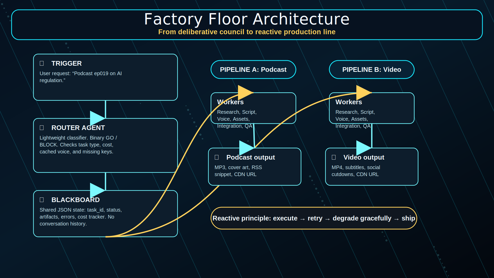</p>

## When to use which mode

| Inquiry shape | Mode | Why |
|---|---|---|
| *"Should I take this contract?"* | Council (deliberative) | Multi-lens disagreement is the value. |
| *"Make a podcast about waiting."* | Council (CONTENT lenses) + Factory (RENDER) | Bob brings the Freudian content; the Factory ships the MP3. |
| *"Daily blog → podcast every morning at 7am."* | Factory only | Recurring, no novel content judgement needed. |
| *"Render last night's council session as audio."* | Factory only | Pure rendering. |
| *"Write me three TikTok videos this week from my recent posts."* | Factory only | Repeat-pattern production. |
| *"What's the shadow in this decision?"* | Council only | Pure judgement. No artefact. |

Think of it as: **council = jazz; factory = assembly line.** Both essential. Different skills. Same musicians.

## The shift: deliberative → reactive

The council's protocol assumes:
- Each bot reads the chat history.
- Each bot waits for context before contributing.
- Tenet synthesises only after lenses have spoken.
- Approval gates exist (human-in-the-loop on high-stakes decisions).

The factory's protocol assumes:
- Each bot reads only its **inbound task slot** from a shared blackboard.
- Bots **don't talk to each other** — they read and write the blackboard.
- **No approval gates** for repeat-pattern work (auto-ship by default).
- **No conversation history passed.** Workers are stateless; the blackboard is stateful.

This is not a contradiction. It's two roles for the same staff. A justice can be a *thinker in the council* on Monday's contract debate AND a *worker on the factory floor* on Tuesday's daily-podcast pipeline. The SOUL stays the same; the **task framing** changes how the protocol fires.

## The 10 factory roles

<p align="center">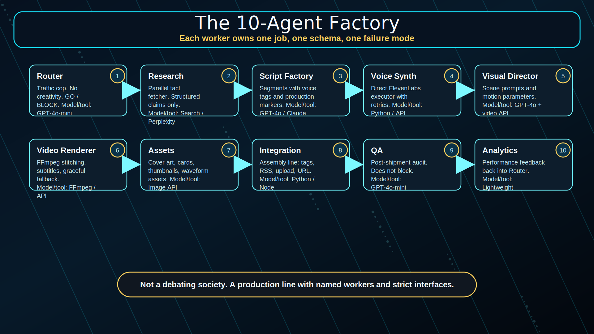</p>

Each role corresponds to a council bot in factory mode. Mapping:

| Factory role | Council bot | Engine | Token budget |
|---|---|---|---|
| **Router** | Tenet | nanobot, gpt-4o-mini | 200 in / 100 out |
| **Research** | Hannah (pattern + sources) or Radar | nanobot or hermes | 1000 in / 500 out |
| **Script Factory** | Bob + Pip (content + craft) | openclaw skill | 2000 in / 1500 out |
| **Voice Synthesizer** | Otto (executor) | openclaw — direct ElevenLabs API | n/a (no LLM) |
| **Visual Director** | Pip + Otto | openclaw — Runway/Kling API | 1000 in / 800 out |
| **Video Renderer** | Otto | openclaw — FFmpeg | n/a |
| **Thumbnail & Assets** | Otto | openclaw — DALL-E / Flux | 500 in / 300 out |
| **Integration** | Otto | openclaw — file ops | 300 in / 200 out |
| **QA** | Ana (duty / correctness) | nanobot | 500 in / 200 out |
| **Analytics & Feedback** | Civic (consequences) | nanobot | 300 in / 200 out |

The reasoners (Ana, Civic, Hannah) take *narrower jobs* in factory mode — Ana is QA (post-hoc audit), Civic is feedback-loop owner, Hannah is research. They're not debating; they're handing off structured artefacts on the blackboard.

## The blackboard — the critical infrastructure

<p align="center">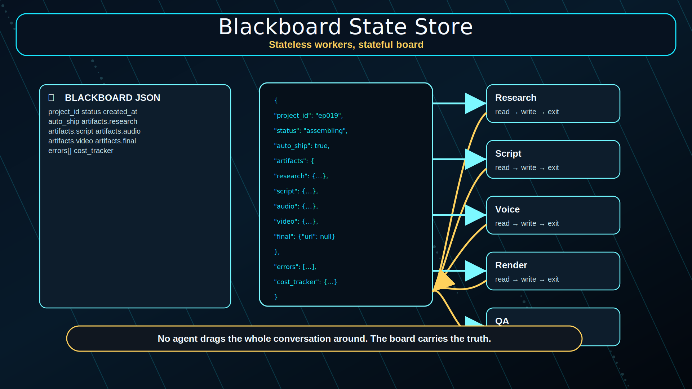</p>

This is what makes the factory work. Without it, you're just running the council faster. With it, you have a real production line.

```json
{
  "project_id": "ep019",
  "status": "assembling",
  "created_at": "2026-05-09T14:05:00Z",
  "auto_ship": true,
  "artifacts": {
    "research": {"facts": [...], "completed_at": "14:06"},
    "script": {"segments": [...], "completed_at": "14:08"},
    "audio": {"files": [...], "completed_at": "14:12"},
    "video": {"scenes": [...], "status": "pending"},
    "final": {"url": null}
  },
  "errors": [
    {"agent": "video_renderer", "time": "14:15", "error": "Runway 429", "action": "retry_2_of_3"}
  ],
  "cost_tracker": {
    "llm_tokens": 4500,
    "api_calls": {"elevenlabs": 4, "runway": 2},
    "estimated_usd": 1.24
  }
}
```

**Every agent reads this, writes this, and dies.** No persistent memory in the worker. No conversation context. Stateless workers, stateful board.

A pragmatic implementation:
- Redis if you have it.
- A single JSON file in `~/.openclaw/factory/<project_id>.json` if you don't.
- The Telegram chat (the council's working memory) is a different layer — the chat is for humans; the blackboard is for bots.

## The pipelines

### Pattern A — Podcast Factory (the existing pipeline, fixed)

<p align="center">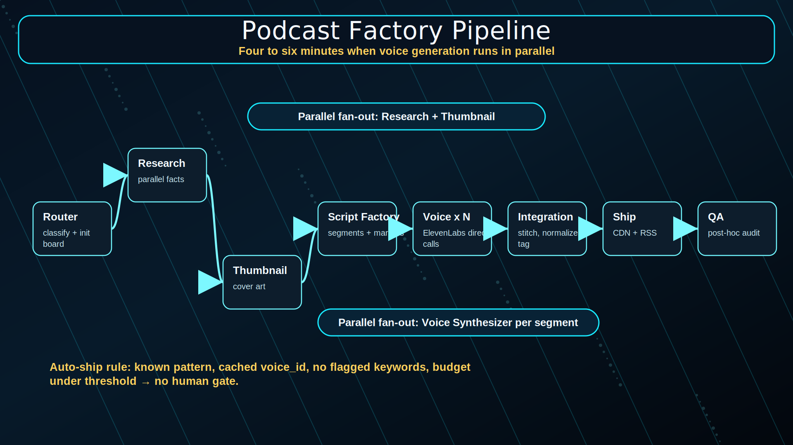</p>

Latency: ~4-6 minutes for a 10-minute episode (parallel voice generation across segments).

### Pattern B — Video Factory (the new pipeline, the missing piece)

<p align="center">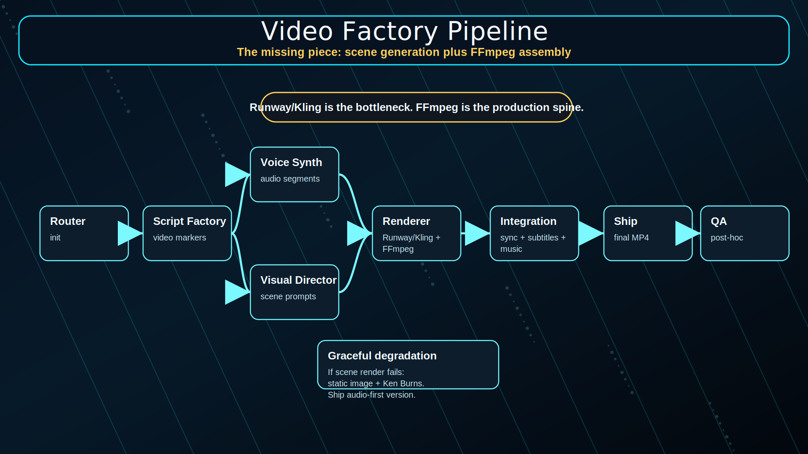</p>

Latency: ~8-12 minutes for a 60-second video (Runway / Kling generation is the bottleneck).

The split-and-rejoin shape is the whole game. Voice and visuals get rendered in parallel, then Integration syncs them with subtitles and music, then it ships. No agent is waiting on another agent's "approval" — they just read the blackboard and write back.

## Error handling — the circuit-breaker pattern

<p align="center">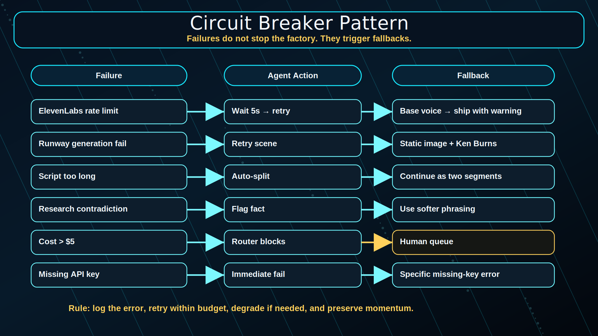</p>

The deliberative council fails by **debating** ("should we wait for the user to clarify?"). The factory fails by **degrading**:

| Failure | Worker action | Fallback |
|---|---|---|
| ElevenLabs 429 (rate limit) | Voice Synth | Wait 5s → retry → fall back to base voice → ship with `warning=voice_clone_unavailable` |
| Runway generation fail | Video Renderer | Use static image + Ken Burns → ship audio-only version |
| Script too long for one segment | Script Factory | Auto-split into 2 segments → continue |
| Research found contradiction | Research Agent | Flag the fact; Script Factory writes *"some sources suggest…"* |
| Total cost > $5 budget | Router | Set `auto_ship=false`, queue for human approval |
| Total cost > $20 budget | Router | Hard-stop. Don't ship. Telegram-alert Dr Non. |

**The principle:** ship something. A degraded artefact + a logged error is more useful than a polished argument about why nothing shipped.

## Migration — going from council to factory for one workflow

<p align="center">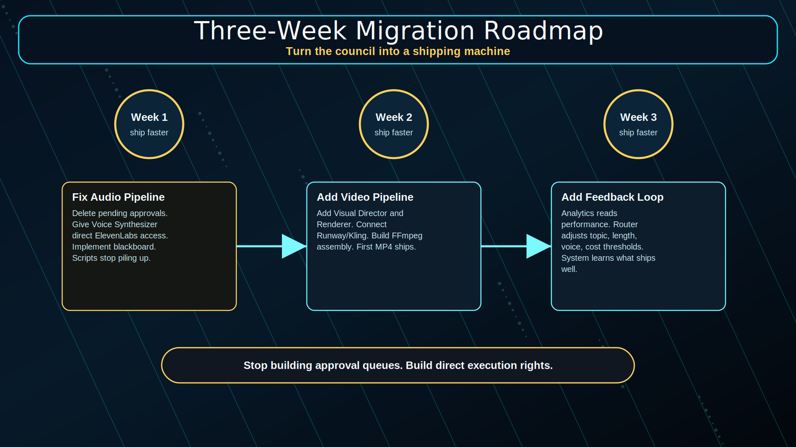</p>

Don't migrate everything. Pick ONE repeat-pattern workflow you currently struggle with — usually the daily podcast or the weekly video. Three weeks:

### Week 1 — fix one audio pipeline
1. **Delete `pending_approvals.json`** (or whatever your current human-gate file is). Replace with `auto_ship=true` for repeat-pattern episodes.
2. **Give the Voice Synthesizer a direct ElevenLabs API key.** No delegation, no approval prompt, no chat-mediated handoff. The worker has its own credential and makes the HTTP call.
3. **Implement the blackboard.** Even a JSON file on disk is enough. Redis if you'll scale to ~10 concurrent pipelines.
4. **Result:** scripts stop accumulating in chat; audio ships immediately.

### Week 2 — add the video pipeline
1. **Visual Director + Video Renderer** as new openclaw skills (or extend `tiktok-wisdom` — it's already 90% of what Visual Director needs).
2. **Runway or Kling API key.**
3. **FFmpeg assembly script** for final render (subtitles + music + scene concat).
4. **Result:** first MP4 ships from a Telegram message in <12 minutes.

### Week 3 — add the feedback loop
1. **Analytics agent** reads the artefact's downstream metrics (download count, completion rate, social shares).
2. **Feeds optimal settings back to Router** — "episodes 8-12 minutes perform best", "voice_id X outperforms Y by 30% on retention".
3. **Result:** the system self-tunes. Next time you ask for a podcast, the Router auto-picks the optimal length and voice.

After three weeks the daily-podcast workflow is reactive end-to-end. You can spend the next week migrating the next workflow (videos, then thumbnails, then social cards).

Don't migrate the council itself. **Some work is genuinely deliberative** — that's the council's permanent home. Just stop forcing factory work through the council's protocol.

## The core principle

> Your current council is *deliberative*: agents think, plan, debate, seek approval. That's the right mode for thinking work.
>
> The factory is *reactive*: agents execute, fail fast, degrade gracefully, ship. That's the right mode for production work.
>
> The "magic integration" happens not because agents are smart, but because **the Integration Agent has API keys and FFmpeg installed** — and because the blackboard is the only handoff medium.
>
> Stop building one council. Build a council *and* a production line. Same musicians, two stages.

---

## Mermaid versions (GitHub-rendered)

### Factory Floor overview

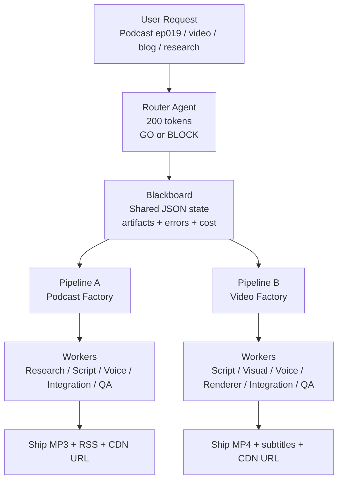

### Podcast Factory

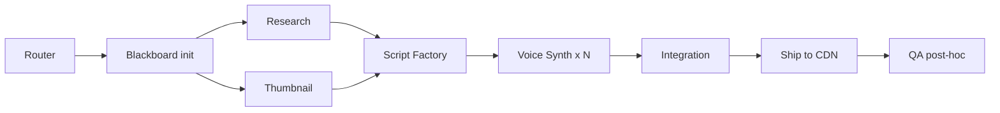

### Video Factory

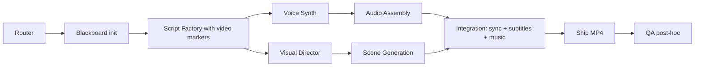

### Circuit breaker

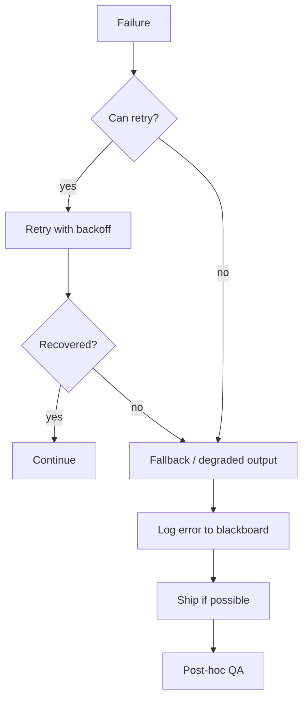

→ Back to [`README.md`](../README.md). For implementation primitives, see also: [`08-skills.md`](08-skills.md) (the openclaw skill catalogue that becomes the workers) and [`05-providers-zero-cost.md`](05-providers-zero-cost.md) (provider stack the workers call).
