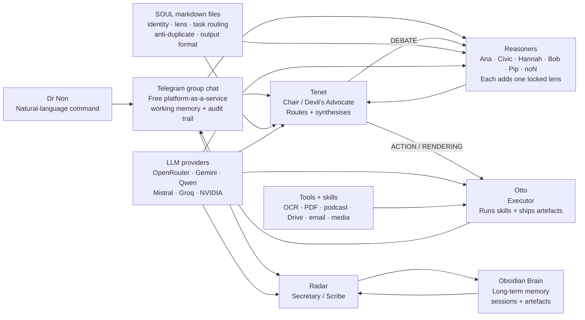
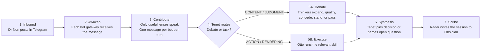
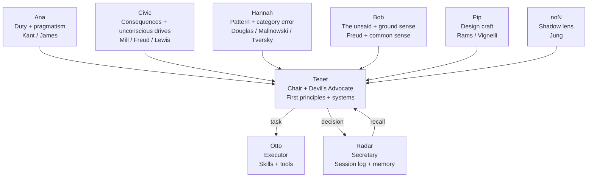
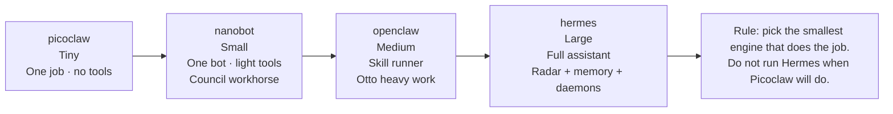
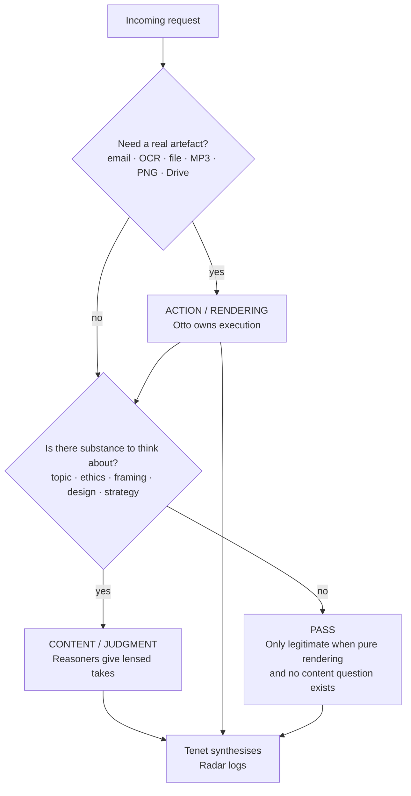
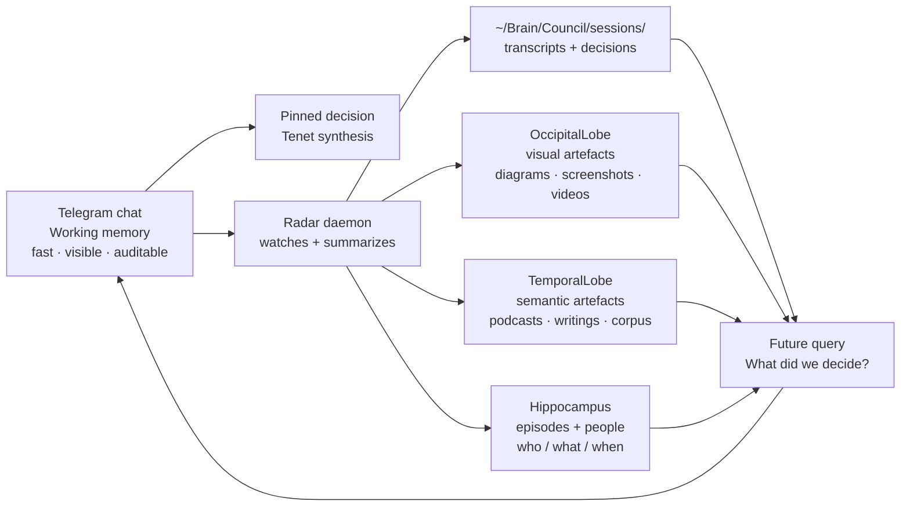

# Diagrams (Mermaid version)

GitHub-rendered Mermaid versions of the six SVG diagrams in [`../diagrams/`](../diagrams/). Use whichever shape works best for your reader — the SVGs are sharper and image-friendly; the Mermaid blocks below are inspectable + editable in-line.

## 1. System map

## 2. One council turn

## 3. The council roles

## 4. Engine ladder

## 5. CONTENT vs ACTION routing

## 6. Memory and artefact flow

